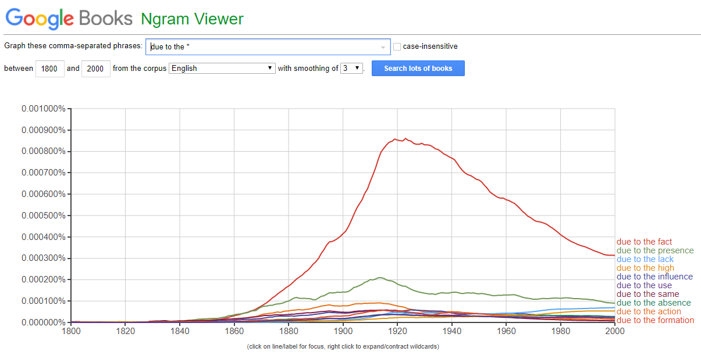
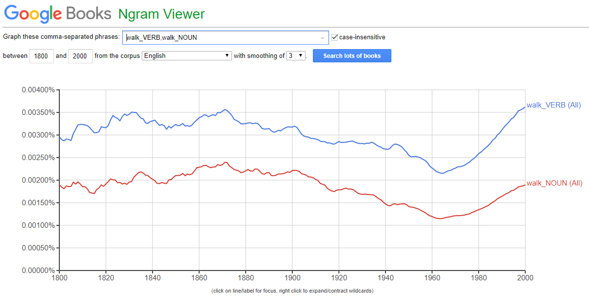
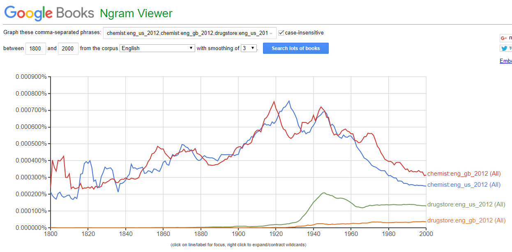
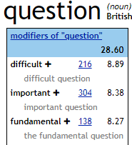
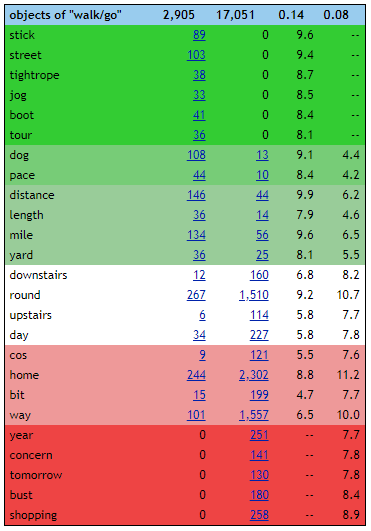
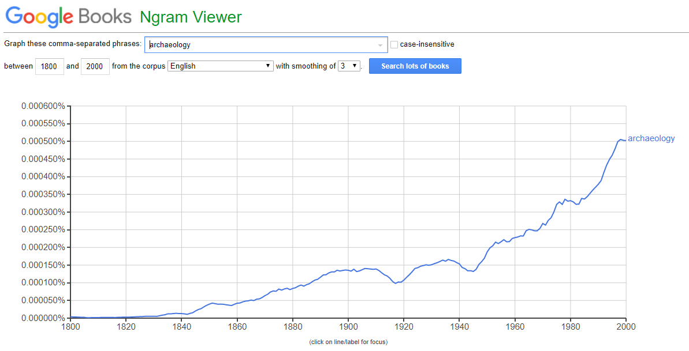

# hw6

Google Ngram Viewer

1. 

2.

3. Я выбрала слово chemist, характерное для британского английского, и слово drugstore, используемое в американском английском. Как видно из графика, со словом drugstore все однозначно - оно редко используется в британском английском. С первым же словом все не так однозначно - с 1800 года по 1940-ые наблюдались периоды его преобладания в американском английском. Это может объясняться тем, что слово drugstore тогда еще не вошло в обиход, как видно из графика.

Sketch Engine

1.

2. Я выбрала синонимичные глаголы walk и go. Оба могут употребляться с дополнениями downstairs, round, upstairs, day. Глагол walk чаще всего употребляется с дополнением stick, глагол go - с дополнением shopping.

Бонусное задание.

Я выбрала слово archaeology. Исходя из данных Sketch Engine, в последнее время наблюдается спад его использования. Судя по Ngram, популярность этого слова стремительно возрастает. Разница в данных может быть следствием разного набора исходных данных, жанра документов и объема корпусов. 

